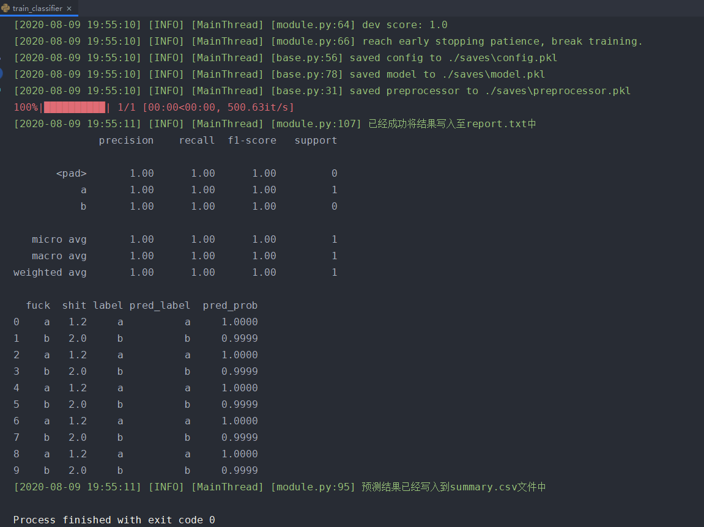
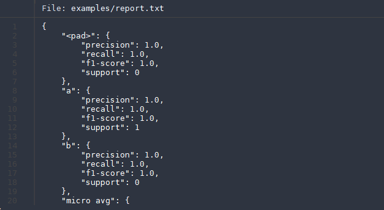
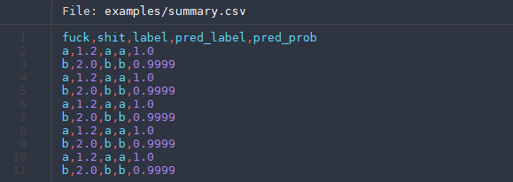
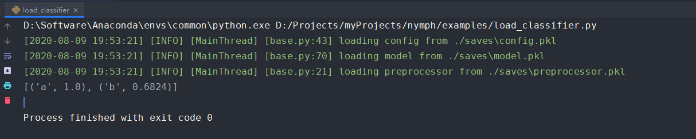

# nymph
基于Pytorch的多特征分类框架

## 概述

基于Pytorch的多特征分类框架，包装的还算可以。可以直接照搬demo，拿csv文件去训练预测。

## 功能

- 多特征分类（特征包括字符型、数值型，其中字符型最好是单个词而非词组或句子）
- 输出详细分类详情

## 原理

- 预处理：对各列非数值类数据分别构建词表并使用Embedding获得低维稠密向量，对数值类数据进行标准化，然后拼接获得各行对应向量
- 模型：使用如全连接网络对模型进行训练
- 预测：使用sklearn获取f1分数，并且获得各类别分类详情

## 安装

使用如下命令进行安装

```shell script
pip install -U nymph
```

## 使用示例

### 训练数据

数据可见[test.csv](./data/test.csv)

如图：


### 训练模型

#### 具体代码

源码如下，具体可参见[train_classifier.py](./examples/train_classifier.py)：

```python

import os

import pandas as pd
from sklearn.model_selection import train_test_split
from nymph.module import Classifier
from nymph.dataset import ClsDataset

project_path = os.path.abspath(os.path.join(__file__, '../../'))
data_path = os.path.join(project_path, r'data\test.csv')
columns = ['fuck', 'shit']
target = 'label'

if __name__ == '__main__':
    # 读取原始数据
    data = pd.read_csv(data_path)

    # 构建分类器并初始化预处理器
    classifier = Classifier()
    data_preprocessor = classifier.init_preprocessor(window_size=0)
    data_preprocessor.fit(data[columns])
    data_preprocessor.set_target(data[target])

    # 划分并构建训练测试数据集
    x_train, x_test, y_train, y_test = train_test_split(data[columns], data[target], test_size=0.1, random_state=2020)

    train_set = ClsDataset(data_preprocessor, x_train, y_train)
    test_set = ClsDataset(data_preprocessor, x_test, y_test)

    # 训练模型
    classifier.train(train_set=train_set, dev_set=test_set)

    # 评估模型分数
    test_score = classifier.score(test_set=test_set)
    print(test_score)

    # 获取各类别分类结果，并保存信息至文件中
    print(classifier.report(test_set, output_path='report.txt'))

    # 对数据进行预测，并将数据和预测结果写入到新的文件中
    classifier.summary(data, 'summary.csv')

```

#### 训练结果

##### 终端输出



##### `report.txt`内容



##### `summary.csv`内容



之后我们可以利用这些结果进行更进一步的badcase分析。

### 预测模型

#### 具体代码

源码如下，具体可参见[load_classifier](./examples/load_classifier.py)

```python
from nymph.module import Classifier

if __name__ == '__main__':
    raw_data = [['a', 1.0], ['b', 1.0]]
    classifier = Classifier()
    classifier.load('./saves')
    res = classifier.predict(raw_data)
    print(res)
```

#### 预测结果

如图：


