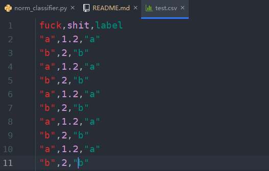

# nymph
基于Pytorch的多特征分类框架

## 概述

基于Pytorch的多特征序列标注和普通分类框架，包装的还算可以。可以直接照搬demo，拿csv文件去训练预测。

## 功能

- 多特征分类（特征包括字符型、数值型，其中字符型最好是单个词而非词组或句子）
- 输出详细分类详情

## 原理

- 预处理：对各列非数值类数据分别构建词表并使用Embedding获得低维稠密向量，对数值类数据进行标准化，然后拼接获得各行对应向量
- 模型：
    - 普通分类：全连接神经网络，NormClassifier（具体效果看特征）
    - 序列标注：Bi-LSTM-CRF，SeqClassifier（效果较好）
- 预测：使用sklearn获取f1分数，并且获得各类别分类详情

## 安装

使用如下命令进行安装

```shell script
pip install -U nymph
```

## 使用示例

### 训练数据

数据可见[test.csv](./data/test.csv)

如图：



### 普通分类

#### 训练模型

源码如下，具体可参见[train_demo_by_norm.py](./examples/train_demo_by_norm.py)：

```python
# -*- coding: utf-8 -*-
import os

import pandas as pd
from nymph.data import NormDataset, split_dataset
from nymph.modules import NormClassifier

project_path = os.path.abspath(os.path.join(__file__, '../../'))
data_path = os.path.join(project_path, r'data\test.csv')
save_path = 'demo_saves'

if __name__ == '__main__':
    # 读取数据
    data = pd.read_csv(data_path)
    # 构建分类器
    classifier = NormClassifier()
    classifier.init_data_processor(data, target_name='label')

    # 构建数据集
    norm_ds = NormDataset(data)

    train_ratio = 0.7
    dev_ratio = 0.2
    test_ratio = 0.1

    train_ds, dev_ds, test_ds = split_dataset(norm_ds, (train_ratio, dev_ratio, test_ratio))

    # 训练模型
    # classifier.train(train_set=train_ds, dev_set=dev_ds, save_path=save_path)
    classifier.train(train_set=norm_ds, dev_set=norm_ds, save_path=save_path)

    # 测试模型
    test_score = classifier.score(norm_ds)
    print('test_score', test_score)

    # 预测模型
    pred = classifier.predict(norm_ds)
    print(pred)

```

###### 训练结果

终端输出


#### 预测模型

源码如下，具体可参见[predict_demo_by_norm.py](./examples/predict_demo_by_norm.py)

```python
# -*- coding: utf-8 -*-
import os

import pandas as pd
from nymph.data import NormDataset, split_dataset
from nymph.modules import NormClassifier

project_path = os.path.abspath(os.path.join(__file__, '../../'))
data_path = os.path.join(project_path, r'data\test.csv')
save_path = 'demo_saves'

if __name__ == '__main__':
    # 读取数据
    data = pd.read_csv(data_path)
    # 构建分类器
    classifier = NormClassifier()

    # 加载分类器
    classifier.load(save_path)

    # 构建数据集
    norm_ds = NormDataset(data)

    # 预测模型
    pred = classifier.predict(norm_ds)
    print(pred)

    # 获取各类别分类结果，并保存信息至文件中
    classifier.report(norm_ds, 'report.csv')

    # 对数据进行预测，并将数据和预测结果写入到新的文件中
    classifier.summary(norm_ds, 'summary.csv')

```

##### 预测结果

如图：

`report.csv`内容


`summary.csv`内容


### 序列标注

#### 训练模型

源码如下，具体可参见[train_demo_by_seq.py](./examples/train_demo_by_seq.py)：

```python
# -*- coding: utf-8 -*-
import os

import pandas as pd
from nymph.data import SeqDataset, split_dataset
from nymph.modules import SeqClassifier

project_path = os.path.abspath(os.path.join(__file__, '../../'))
data_path = os.path.join(project_path, r'data\test.csv')
save_path = 'demo_saves_seq'


def split_fn(dataset: list):
    return list(range(len(dataset)+1))


if __name__ == '__main__':
    # 读取数据
    data = pd.read_csv(data_path)
    # 构建分类器
    classifier = SeqClassifier()
    classifier.init_data_processor(data, target_name='label')

    # 构建数据集
    norm_ds = SeqDataset(data, split_fn=split_fn, min_len=4)

    train_ratio = 0.7
    dev_ratio = 0.2
    test_ratio = 0.1

    train_ds, dev_ds, test_ds = split_dataset(norm_ds, (train_ratio, dev_ratio, test_ratio))

    # 训练模型
    # classifier.train(train_set=train_ds, dev_set=dev_ds, save_path=save_path)
    classifier.train(train_set=norm_ds, dev_set=norm_ds, save_path=save_path)

    # 测试模型
    test_score = classifier.score(norm_ds)
    print('test_score', test_score)

    # 预测模型
    pred = classifier.predict(norm_ds)
    print(pred)

```

##### 训练结果

终端输出


#### 预测模型

源码如下，具体可参见[predict_demo_by_seq.py](./examples/predict_demo_by_seq.py)

```python
# -*- coding: utf-8 -*-
import os

import pandas as pd
from nymph.data import SeqDataset, split_dataset
from nymph.modules import SeqClassifier

project_path = os.path.abspath(os.path.join(__file__, '../../'))
data_path = os.path.join(project_path, r'data\test.csv')
save_path = 'demo_saves_seq'


def split_fn(dataset: list):
    return list(range(len(dataset)+1))


if __name__ == '__main__':
    # 读取数据
    data = pd.read_csv(data_path)
    # 构建分类器
    classifier = SeqClassifier()

    # 加载分类器
    classifier.load(save_path)

    # 构建数据集
    seq_ds = SeqDataset(data, split_fn=split_fn, min_len=4)

    # 预测模型
    pred = classifier.predict(seq_ds)
    print(pred)

    # 获取各类别分类结果，并保存信息至文件中
    classifier.report(seq_ds, 'seq_demo_report.csv')

    # 对数据进行预测，并将数据和预测结果写入到新的文件中
    classifier.summary(seq_ds, 'seq_demo_summary.csv')

```

如图：

`seq_demo_report.csv`内容


`seq_demo_summary.csv`内容


## 更新历史

- 0.1.0: 初始化项目，增加全连接模型
- 0.2.0: 增加序列标注模型，大幅重构项目结构与内部实现代码
- 0.2.1: 更新代码，使GPU和CPU下同时可用
- 0.2.2: 增加将训练过程的loss和f1值写入到TensorBoard中


